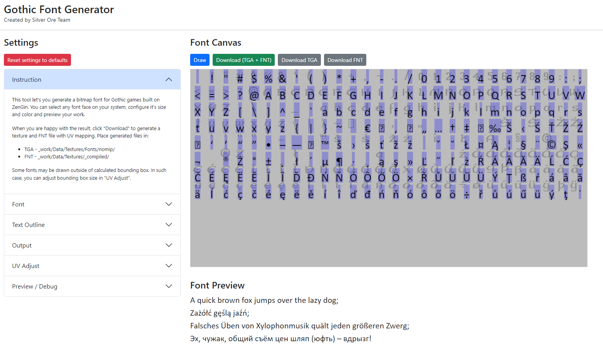

# Gothic Font Generator
Web tool for generating bitmap fonts for Gothic games based on ZenGin from any font face available on a local computer. 



## Try Online
[http://gothic-font-generator.s3-website.eu-central-1.amazonaws.com/](http://gothic-font-generator.s3-website.eu-central-1.amazonaws.com/)

## Development
To work with the project you need Node.js and npm. 

### Install dependencies
```sh
npm install
```

### Run local dev server
```sh
npm start
```

### Build release
```sh
npm run build
```
